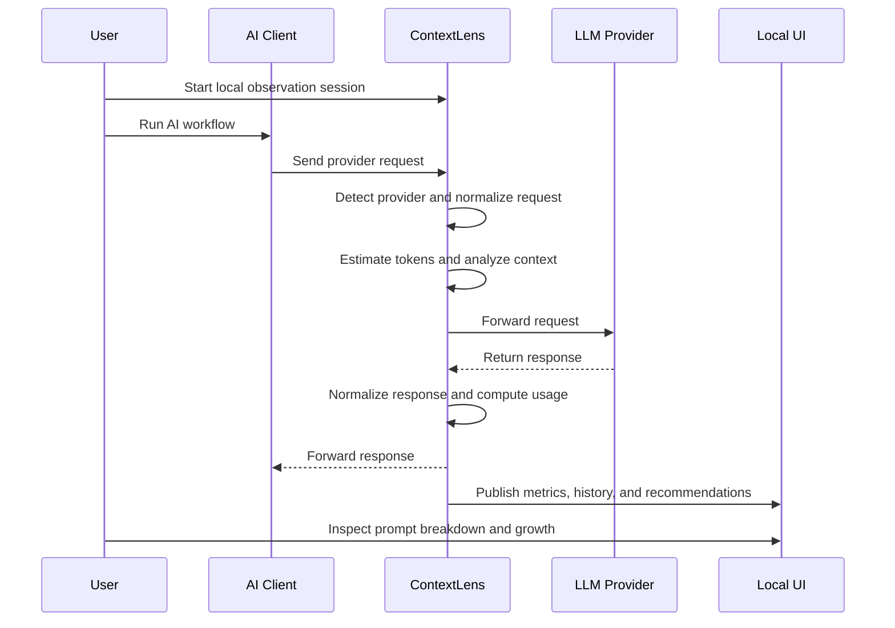
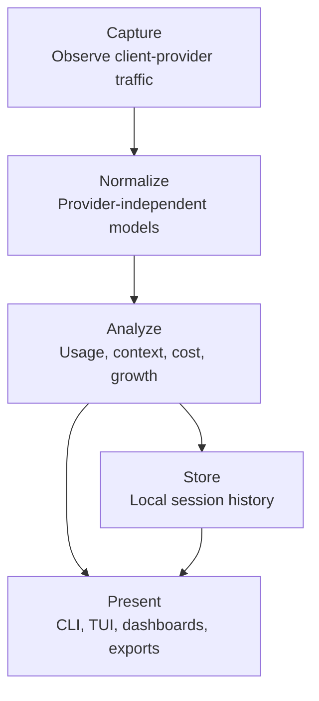

# ContextLens Product Requirements Document

**Project:** ContextLens  
**Version:** 0.1  
**Status:** Draft  
**Owner:** ContextLens Engineering  
**Last Updated:** 2026-07-02

---

## Purpose

This Product Requirements Document defines what ContextLens must achieve as a product before implementation begins.

It translates the project vision into user problems, product goals, functional requirements, non-functional requirements, MVP scope, success criteria, and explicit non-goals.

This document is the product-level source of truth for the Foundation and MVP phases. Architecture, ADRs, specifications, interfaces, implementation, tests, and documentation updates must trace back to this document or to higher-level vision documents.

---

## Scope

This document covers:

- Target users and use cases.
- Product goals and non-goals.
- Functional requirements for the MVP and near-term platform.
- Non-functional requirements.
- Data and observability expectations.
- User experience expectations.
- MVP acceptance criteria.
- Product risks and assumptions.
- Future product evolution.

This document does not define:

- Concrete architecture decisions.
- Provider adapter internals.
- Database schemas.
- API contracts.
- UI layouts.
- Package structure.
- Implementation sequencing.

Those details belong in architecture documents, ADRs, component specifications, interface definitions, and implementation plans.

---

## Motivation

Developers increasingly rely on AI coding assistants, agentic CLIs, IDE plugins, SDKs, and custom AI workflows. These systems construct prompts from many sources, but users often cannot see or explain the final context sent to an LLM provider.

The result is a product gap:

- Costs rise without clear explanation.
- Context windows fill unexpectedly.
- Tool output overwhelms useful prompt content.
- Duplicate files or messages consume tokens repeatedly.
- Latency increases without request-level diagnosis.
- Prompt quality degrades as context grows.
- Teams cannot reason about AI workflow efficiency using deterministic evidence.

ContextLens exists to make AI prompt construction and context behavior observable.

The product must help users understand what happened, why it happened, and what can be improved without making additional model calls.

---

## Background

AI observability is still emerging. Many existing tools focus on provider usage analytics, logging prompts and completions, cost dashboards, or hosted tracing.

Those capabilities are useful but do not fully solve context observability for local AI development workflows.

ContextLens focuses on the runtime path between AI clients and model providers. It observes requests and responses, normalizes provider differences, measures usage, attributes context sources, and reports deterministic findings through local interfaces.

The product is intentionally local first because AI prompts often contain source code, credentials, internal architecture, customer data, and private reasoning traces. Hosted or team features may be added later, but the base product must remain useful without them.

---

## Product Vision

ContextLens is the local-first AI observability platform for prompt and context behavior.

It should become the tool developers reach for when they need to answer:

- What was sent to the model?
- Why did this request use so many tokens?
- Which inputs contributed most to prompt size?
- How did context change over the session?
- Which tool outputs, files, messages, or system instructions dominate the request?
- What did the request cost?
- How much latency did the provider and observation layer introduce?
- Which deterministic optimization opportunities are visible?

ContextLens should be to AI applications what `htop`, Wireshark, Prometheus, and Grafana are to traditional systems: a way to inspect, measure, understand, and improve runtime behavior.

---

## Users

### Primary Users

#### Individual Software Engineer

An engineer using tools such as AI coding CLIs, IDE assistants, agentic coding tools, or provider SDKs.

Needs:

- See request-level token usage.
- Understand prompt composition.
- Find large context contributors.
- Reduce unnecessary cost.
- Debug degraded model behavior.
- Compare consecutive requests.

#### AI Application Developer

A developer building applications or agents on top of OpenAI, Anthropic, or other provider SDKs.

Needs:

- Inspect outgoing provider requests.
- Validate prompt construction logic.
- Measure latency and cost.
- Test provider adapters and model behavior.
- Capture local observability without adding external dependencies.

#### Platform Engineer

An engineer responsible for AI tooling, developer experience, internal platforms, or shared AI infrastructure.

Needs:

- Evaluate usage patterns across tools.
- Compare providers and models.
- Establish observability standards.
- Integrate with metrics and tracing systems.
- Support privacy-conscious local workflows.

### Secondary Users

#### Prompt Engineer

Needs:

- Compare prompt revisions.
- Understand context growth.
- Identify redundant instructions or examples.
- Measure impact of prompt structure on usage and latency.

#### Researcher

Needs:

- Inspect prompt evolution.
- Study agent and tool behavior.
- Export deterministic metrics.
- Reproduce observations from captured sessions.

#### Engineering Leader

Needs:

- Understand cost drivers.
- Evaluate AI workflow efficiency.
- Identify governance and privacy requirements.
- Support later team-level reporting.

---

## Core Use Cases

### UC-001: Observe a Local AI Coding Session

A developer routes an AI coding assistant through ContextLens and sees live request activity, token usage, latency, estimated cost, and context contributors.

### UC-002: Explain Unexpected Token Growth

A developer notices a request is much larger than previous requests. ContextLens shows which context sources grew, which repeated segments appeared, and how the prompt changed.

### UC-003: Attribute Prompt Content to Sources

A developer inspects a prompt and sees whether tokens came from user messages, system instructions, files, tool output, memory, retrieved content, or provider metadata.

### UC-004: Compare Consecutive Requests

A developer compares two requests from the same session and sees added, removed, repeated, and expanded context segments.

### UC-005: Estimate Cost Locally

A developer sees estimated request cost based on provider, model, input tokens, output tokens, and known pricing metadata.

### UC-006: Debug Provider Usage Metadata

A developer compares locally estimated token usage with provider-reported usage when available.

### UC-007: Review Session History

A developer reviews recent requests, response metadata, usage trends, context growth, and deterministic recommendations from a stored local session.

### UC-008: Extend Observability Through Plugins

A contributor adds an analyzer, exporter, provider adapter, or storage adapter without modifying the core domain.

---

## Goals

### Product Goals

- Make AI request and context behavior visible.
- Explain prompt size and context growth.
- Help users reduce unnecessary token usage.
- Provide deterministic recommendations without extra LLM calls.
- Support local-first operation.
- Support multiple providers and clients through canonical abstractions.
- Provide live and historical observability.
- Enable an open source plugin ecosystem.

### Engineering Goals

- Preserve provider independence.
- Preserve client independence.
- Keep the core domain framework-free.
- Support async-first runtime behavior.
- Keep observation overhead low.
- Make all major behavior testable without real provider calls.
- Maintain traceability from documentation to implementation.

### Community Goals

- Establish clear contribution paths.
- Make architecture understandable to human and AI contributors.
- Provide high-quality documentation as a first-class product surface.
- Encourage provider adapters, analyzers, and exporters as extension points.

---

## Non-Goals

The MVP will not provide:

- LLM-generated optimization recommendations.
- Automatic prompt rewriting.
- Automatic request modification.
- Hosted cloud dashboards.
- User authentication.
- Team collaboration features.
- Billing management.
- Fine-tuning workflows.
- Dataset management.
- Model evaluation suites.
- Prompt generation.
- Agent orchestration.
- Mandatory telemetry collection.

These exclusions protect the MVP from becoming a general AI platform before the observability foundation is stable.

---

## Requirements

Requirement IDs use the format `PRD-<AREA>-<NUMBER>`.

### Proxy And Capture

| ID | Requirement | Priority |
| --- | --- | --- |
| PRD-PROXY-001 | ContextLens must provide a local observation path for AI client-to-provider HTTP traffic. | MVP |
| PRD-PROXY-002 | ContextLens must capture request metadata including method, URL, headers allowed by privacy settings, body size, timestamp, and correlation identifiers. | MVP |
| PRD-PROXY-003 | ContextLens must capture response metadata including status, latency, body size, streaming state, provider usage metadata when available, and error details. | MVP |
| PRD-PROXY-004 | ContextLens must support request and response streaming without requiring full buffering for the forwarding path. | MVP |
| PRD-PROXY-005 | ContextLens must allow future non-proxy ingestion paths such as SDK instrumentation or log import. | Future |

### Provider Detection And Normalization

| ID | Requirement | Priority |
| --- | --- | --- |
| PRD-PROVIDER-001 | ContextLens must detect supported providers from request targets and payload shape. | MVP |
| PRD-PROVIDER-002 | ContextLens must normalize provider requests into canonical request models before analysis. | MVP |
| PRD-PROVIDER-003 | ContextLens must normalize provider responses into canonical response models before analysis. | MVP |
| PRD-PROVIDER-004 | ContextLens must represent provider capabilities without requiring provider-name conditionals in the core domain. | MVP |
| PRD-PROVIDER-005 | ContextLens must preserve provider-specific metadata in an extension-safe structure for later inspection. | MVP |

### Token Usage And Cost

| ID | Requirement | Priority |
| --- | --- | --- |
| PRD-USAGE-001 | ContextLens must estimate input tokens locally when a deterministic tokenizer is available. | MVP |
| PRD-USAGE-002 | ContextLens must record provider-reported token usage when available. | MVP |
| PRD-USAGE-003 | ContextLens must distinguish estimated usage from provider-reported usage. | MVP |
| PRD-USAGE-004 | ContextLens must estimate request cost from provider, model, usage, and local pricing metadata. | MVP |
| PRD-USAGE-005 | ContextLens must show when cost cannot be estimated reliably. | MVP |
| PRD-USAGE-006 | ContextLens must support future pricing metadata updates without changing the domain model. | Future |

### Prompt And Context Analysis

| ID | Requirement | Priority |
| --- | --- | --- |
| PRD-ANALYSIS-001 | ContextLens must break prompts into attributable context segments when the request format permits it. | MVP |
| PRD-ANALYSIS-002 | ContextLens must classify context segments by source category such as system, user, assistant, file, tool output, memory, retrieved context, or unknown. | MVP |
| PRD-ANALYSIS-003 | ContextLens must report token contribution by segment and source category when tokenization is available. | MVP |
| PRD-ANALYSIS-004 | ContextLens must detect exact duplicate context segments within a request. | MVP |
| PRD-ANALYSIS-005 | ContextLens must compare consecutive requests in a session and report prompt growth. | MVP |
| PRD-ANALYSIS-006 | ContextLens must support future analyzers that can run asynchronously from the request forwarding path. | MVP |

### Recommendations

| ID | Requirement | Priority |
| --- | --- | --- |
| PRD-REC-001 | ContextLens must generate deterministic recommendations from observed data. | MVP |
| PRD-REC-002 | Recommendations must include evidence, affected context segments or requests, and expected impact category. | MVP |
| PRD-REC-003 | Recommendations must not require additional LLM requests in the core product. | MVP |
| PRD-REC-004 | Recommendation rules must be explainable and testable. | MVP |
| PRD-REC-005 | Optional future plugins may provide non-deterministic or LLM-assisted recommendations, but they must be clearly marked as such. | Future |

### Storage And History

| ID | Requirement | Priority |
| --- | --- | --- |
| PRD-STORAGE-001 | ContextLens must store session history locally for MVP usage. | MVP |
| PRD-STORAGE-002 | ContextLens must persist requests, responses, normalized metadata, usage, cost estimates, analysis results, and recommendations. | MVP |
| PRD-STORAGE-003 | ContextLens must support configurable retention behavior. | MVP |
| PRD-STORAGE-004 | ContextLens must allow sensitive prompt bodies to be excluded or redacted according to configuration. | MVP |
| PRD-STORAGE-005 | ContextLens must allow future storage adapters without changing application use cases. | Future |

### User Interfaces

| ID | Requirement | Priority |
| --- | --- | --- |
| PRD-UI-001 | ContextLens must provide a CLI entry point for starting, configuring, and inspecting local observation sessions. | MVP |
| PRD-UI-002 | ContextLens must provide a terminal dashboard for live usage, latency, cost, and request status. | MVP |
| PRD-UI-003 | ContextLens must provide a way to inspect request details, prompt breakdown, and recommendations. | MVP |
| PRD-UI-004 | ContextLens should provide a basic local web dashboard after core CLI and TUI workflows are stable. | Near-Term |
| PRD-UI-005 | ContextLens must make uncertainty visible, including estimated tokens, missing provider usage, unsupported request shapes, and unknown context sources. | MVP |

### Privacy And Security

| ID | Requirement | Priority |
| --- | --- | --- |
| PRD-SEC-001 | ContextLens must operate locally by default. | MVP |
| PRD-SEC-002 | ContextLens must not send captured prompts, responses, or metadata to ContextLens-operated services in the MVP. | MVP |
| PRD-SEC-003 | ContextLens must document what data is captured and where it is stored. | MVP |
| PRD-SEC-004 | ContextLens must support redaction or exclusion of sensitive request and response fields. | MVP |
| PRD-SEC-005 | ContextLens must avoid logging secrets by default where provider headers or environment-derived credentials are involved. | MVP |

### Extensibility

| ID | Requirement | Priority |
| --- | --- | --- |
| PRD-EXT-001 | ContextLens must support replaceable provider adapters. | MVP |
| PRD-EXT-002 | ContextLens must support replaceable storage adapters. | Near-Term |
| PRD-EXT-003 | ContextLens must support analyzer extension points. | Near-Term |
| PRD-EXT-004 | ContextLens must support exporter extension points for systems such as OpenTelemetry, Prometheus, and local files. | Future |
| PRD-EXT-005 | ContextLens must document contribution requirements for new adapters and analyzers. | Near-Term |

---

## Non-Functional Requirements

### Performance

| ID | Requirement | Target |
| --- | --- | --- |
| PRD-NFR-PERF-001 | Median added non-streaming request overhead should remain below 10 ms excluding provider latency. | MVP target |
| PRD-NFR-PERF-002 | Streaming forwarding must begin before complete response analysis when possible. | MVP target |
| PRD-NFR-PERF-003 | Heavy analysis should be asynchronous or deferred where it would block request forwarding. | MVP target |
| PRD-NFR-PERF-004 | Local storage writes must not cause unbounded request latency. | MVP target |

### Reliability

| ID | Requirement | Target |
| --- | --- | --- |
| PRD-NFR-REL-001 | Observation failures must not silently corrupt captured data. | MVP |
| PRD-NFR-REL-002 | Provider forwarding errors must be reported distinctly from ContextLens analysis errors. | MVP |
| PRD-NFR-REL-003 | Unsupported providers or payloads must degrade to metadata capture where possible. | MVP |
| PRD-NFR-REL-004 | Session history should remain usable after interrupted runs. | MVP |

### Portability

| ID | Requirement | Target |
| --- | --- | --- |
| PRD-NFR-PORT-001 | ContextLens must support Python 3.12 or later. | MVP |
| PRD-NFR-PORT-002 | ContextLens must support Windows, macOS, and Linux. | MVP |
| PRD-NFR-PORT-003 | Local paths, sockets, and certificate behavior must be documented per operating system. | MVP |

### Maintainability

| ID | Requirement | Target |
| --- | --- | --- |
| PRD-NFR-MAINT-001 | Product behavior must trace to documentation. | MVP |
| PRD-NFR-MAINT-002 | Core domain logic must be testable without network access. | MVP |
| PRD-NFR-MAINT-003 | Provider adapters must be testable with recorded or synthetic fixtures. | MVP |
| PRD-NFR-MAINT-004 | Public interfaces must use strong typing. | MVP |

---

## MVP Scope

### Included In Version 0.1

- Local HTTP observation path.
- Initial HTTPS strategy documented before implementation.
- OpenAI provider adapter.
- Anthropic provider adapter.
- Canonical request and response models.
- Provider capability model.
- Local token estimation where deterministic tokenizer support exists.
- Provider-reported usage capture.
- Cost estimation from local pricing metadata.
- Session and request history.
- Prompt breakdown by canonical message and context segment.
- Exact duplicate segment detection.
- Consecutive request growth analysis.
- Deterministic recommendation rules.
- SQLite-backed local storage.
- CLI entry point.
- Terminal dashboard.
- Privacy and retention configuration.

### Excluded From Version 0.1

- Hosted dashboards.
- Account management.
- Team collaboration.
- Distributed deployments.
- Kubernetes support.
- Automatic prompt rewriting.
- LLM-assisted analysis.
- Full OpenTelemetry export.
- Full Prometheus exporter.
- Enterprise policy management.
- Browser extension.

---

## MVP User Journey

The core product experience should keep the user close to their existing workflow. ContextLens should add visibility without requiring the user to abandon their AI client.

---

## Acceptance Criteria

The MVP is acceptable when a developer can:

- Start ContextLens locally from the CLI.
- Route at least one supported AI client or SDK workflow through ContextLens.
- Observe live requests in a terminal dashboard.
- See provider, model, latency, status, token usage, and estimated cost per request.
- Inspect a normalized prompt breakdown for supported OpenAI and Anthropic request shapes.
- Identify the largest context contributors in a request.
- Compare consecutive requests in a session and see context growth.
- See exact duplicate context segments when they exist.
- Review stored local session history after the request completes.
- Receive at least three deterministic recommendation types with evidence.
- Configure retention or redaction behavior for captured prompt data.
- Run core domain and application tests without contacting real providers.

---

## Success Metrics

### Product Metrics

- Users can identify the largest context contributor in a captured request within one minute.
- Users can explain why a request grew relative to the previous request.
- Users can distinguish estimated usage from provider-reported usage.
- Users can review session history after a local run.
- Users can understand when analysis is incomplete or uncertain.

### Technical Metrics

- Median added proxy overhead remains below the MVP target for representative non-streaming requests.
- Streaming responses remain usable through the observation layer.
- Core domain tests do not require network access.
- Provider adapter tests use fixtures rather than live model calls.
- The MVP supports at least OpenAI and Anthropic request normalization.

### Documentation Metrics

- Every implemented MVP capability links to a requirement ID.
- Every major architectural decision has an ADR before implementation.
- Every public interface has a specification before code.
- User-facing behavior is documented before release.

---

## Design

At the product level, ContextLens has five major product surfaces:

These product surfaces must remain conceptually separate even if early implementation packages are small.

- Capture concerns how traffic enters the system.
- Normalize concerns how provider-specific data becomes product-understandable data.
- Analyze concerns deterministic interpretation of prompts, usage, and context.
- Store concerns local history, retention, and review.
- Present concerns how users inspect observations and recommendations.

---

## Alternatives Considered

### Start With A Dashboard-Only Product

A dashboard-first product could provide an impressive first impression, but without capture, normalization, and analysis foundations it would become a thin visualization layer.

This is rejected for the MVP. The product must first produce trustworthy observations.

### Start With SDK Instrumentation Only

SDK instrumentation is easier to type and test than proxying, but it requires application changes and would not support existing AI clients well.

This is rejected as the only MVP path. SDK support remains a future ingestion path.

### Optimize Prompts Automatically

Automatic prompt rewriting could create immediate user-visible savings, but it changes behavior and would require high trust in the tool.

This is rejected for the MVP. ContextLens should observe, explain, and recommend before it mutates user workflows.

### Use LLMs For Analysis

LLM-assisted analysis may discover semantic issues deterministic rules cannot catch, but it introduces cost, nondeterminism, privacy exposure, and circular dependency on model behavior.

This is rejected for the core product. It may be considered later as an explicit opt-in plugin category.

---

## Trade-Offs

### MVP Depth vs. Provider Breadth

Supporting many providers shallowly would make the product appear broad but weaken the quality of analysis. The MVP should support a small number of providers deeply enough to validate canonical models and context attribution.

### Local Storage vs. Team Analytics

Local storage protects privacy and simplifies adoption. It limits team-wide analytics in the MVP. The architecture should leave room for future exporters and shared backends.

### Transparent Observation vs. Setup Complexity

Proxy-based observation supports unmodified clients but introduces setup complexity, especially for HTTPS. The MVP must document setup honestly and provide graceful fallback where full capture is not possible.

### Deterministic Rules vs. Rich Semantics

Deterministic recommendations are explainable and testable but may miss semantic issues. The MVP should prefer reliable evidence over speculative intelligence.

---

## Risks

- Some AI clients may not support proxy configuration cleanly.
- HTTPS interception may create user trust and setup challenges.
- Provider request formats may change faster than adapters can be maintained.
- Tokenizers may not perfectly match provider billing behavior.
- Prompt and response data may include sensitive information.
- Storing full request bodies may create local privacy and disk usage concerns.
- MVP scope may expand into dashboards before analysis quality is strong.
- Canonical models may be under-designed if requirements are not validated with realistic fixtures.
- Cost estimation may be misleading if pricing metadata becomes stale.

---

## Future Evolution

After the MVP, ContextLens may evolve toward:

- Local web dashboard.
- OpenTelemetry traces and metrics.
- Prometheus exporter.
- Grafana dashboard templates.
- Additional provider adapters.
- SDK-based instrumentation.
- Plugin marketplace or registry.
- Security and compliance analyzers.
- Team analytics with explicit opt-in data movement.
- Distributed deployment modes.
- Provider benchmarking.
- Prompt evolution reports.
- CI-based prompt regression checks.

Future work must preserve the product boundary between observation and mutation unless a later ADR explicitly changes that principle.

---

## References

- [ContextLens Vision](../vision/VISION.md)
- Root `PRD.md` draft product requirements.
- Root `README.md` documentation hierarchy.
- `docs-architecture-00-Overview.md.md` draft architecture overview.
- Hexagonal Architecture and Ports and Adapters.
- Event-Driven Architecture.
- OpenTelemetry observability concepts.
- Prometheus and Grafana observability workflows.
