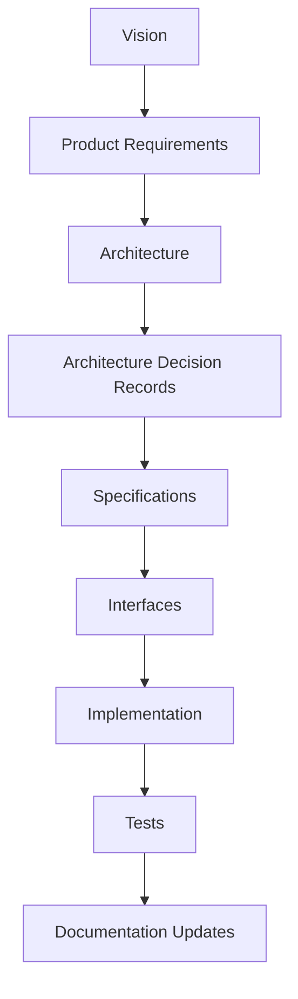
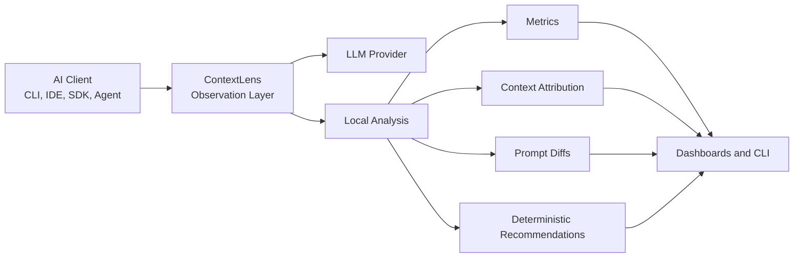
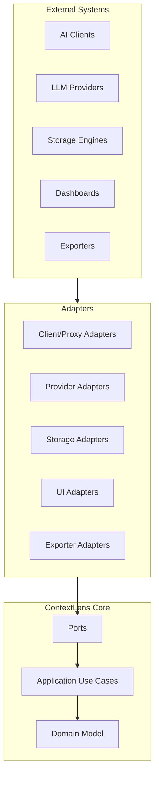

# ContextLens Vision

**Version:** 0.1  
**Status:** Draft  
**Owner:** ContextLens Engineering  
**Last Updated:** 2026-07-02

---

## Purpose

This document defines the long-term vision for ContextLens.

It is the highest-level engineering and product reference for the project. Product requirements, architecture documents, ADRs, specifications, implementation plans, tests, and documentation updates must remain traceable to the vision described here.

ContextLens exists to make AI application behavior observable without changing the behavior being observed.

---

## Scope

This document covers:

- The problem ContextLens exists to solve.
- The product vision and engineering mission.
- The principles that constrain future design.
- The intended user and system outcomes.
- The boundaries between observability, optimization, and automation.
- The long-term evolution path for the platform.

This document does not define:

- Detailed MVP requirements.
- Provider-specific API behavior.
- Storage schemas.
- UI wireframes.
- Protocol specifications.
- Implementation-level package structure.

Those belong in lower-level product, architecture, ADR, and specification documents.

---

## Motivation

AI development tools increasingly construct large, dynamic prompts from many hidden inputs:

- User instructions.
- Chat history.
- Repository files.
- Tool outputs.
- Agent plans.
- System prompts.
- Steering documents.
- Memory stores.
- Retrieved context.
- Provider-specific metadata.

Developers often see only the final model response, total token usage, and sometimes a cost estimate. That is not enough.

When a prompt becomes expensive, slow, low quality, or difficult to debug, developers need to understand where the context came from, how it changed over time, and which parts were responsible for growth or waste. Without this visibility, prompt engineering becomes guesswork and AI-assisted development becomes harder to operate at scale.

ContextLens is motivated by a simple gap:

> Modern AI applications have powerful execution loops, but weak observability into the context those loops create.

ContextLens fills that gap locally, deterministically, and without making additional LLM requests.

---

## Background

Traditional observability platforms help engineers understand production systems through metrics, logs, traces, dashboards, and alerts. They expose behavior that would otherwise remain hidden.

AI applications need an equivalent observability layer, but their most important runtime artifact is not only CPU, memory, network traffic, or request volume. It is context.

Context is assembled from many sources and transformed before being sent to a provider. The assembled prompt determines cost, latency, model behavior, and available reasoning space. However, most AI clients treat prompt construction as an internal detail.

Existing approaches usually focus on:

- Provider API logging.
- Aggregate token usage.
- Cost reporting.
- Model latency.
- Prompt and response capture.

Those capabilities are useful, but incomplete. ContextLens is designed to go deeper by explaining the composition and evolution of context itself.

---

## Vision

ContextLens will become the standard local-first observability platform for AI application context.

It should feel like:

- `htop` for live AI runtime behavior.
- Wireshark for request and response inspection.
- Prometheus for structured metrics.
- Grafana for historical analysis and dashboards.

The platform should help developers answer questions such as:

- What exactly was sent to the model?
- Which files, tools, messages, or resources contributed most to token usage?
- Why did context grow between two requests?
- Which repeated or low-value inputs are consuming context window space?
- How much did a session cost, and which requests drove the cost?
- Which provider capabilities were used?
- Which optimization opportunities are deterministic and explainable?

ContextLens should observe AI applications without becoming the AI application.

It should sit between clients and providers, normalize what it sees, analyze it locally, and expose insight through replaceable interfaces.

---

## Product Positioning

ContextLens is an AI observability platform, not a prompt generation tool.

It does not exist to write prompts for users. It exists to show users how prompts are constructed, how context changes, and where engineering trade-offs are being made.

ContextLens should remain:

- Provider agnostic.
- Client agnostic.
- Local first.
- Privacy conscious.
- Deterministic by default.
- Extensible through plugins and adapters.
- Useful without requiring hosted infrastructure.

The core product promise is:

> ContextLens explains AI context behavior without spending more AI tokens to do it.

---

## Requirements

The vision creates the following high-level requirements.

### Functional Requirements

ContextLens must eventually provide:

- Transparent observation of AI client-to-provider traffic.
- Provider detection and request normalization.
- Canonical models for requests, responses, messages, tools, usage, and provider capabilities.
- Local token counting where deterministic tokenizers are available.
- Usage, latency, and cost estimation.
- Prompt and context composition analysis.
- Context attribution by source.
- Request-to-request prompt diffing.
- Session history.
- Tool usage tracking.
- Resource usage tracking.
- Deterministic optimization recommendations.
- Live and historical dashboards.
- Extensible analyzers, exporters, providers, and storage backends.

### Non-Functional Requirements

ContextLens must be:

- Async first.
- Cross-platform.
- Strongly typed.
- Low overhead.
- Locally operable.
- Testable without real providers.
- Safe for sensitive prompt data by default.
- Independent of any single AI provider, SDK, client, UI, or database.

### Documentation Requirements

ContextLens must treat documentation as the primary artifact.

Every meaningful feature must trace through:

Code that cannot be traced back to documentation is considered premature.

---

## Design

At the vision level, ContextLens is designed as an observability layer around AI application traffic.

The system should be shaped around a stable core domain and replaceable outer components.

Dependencies must point inward. Frameworks, SDKs, databases, dashboards, and provider APIs belong outside the core domain.

The core domain should model stable concepts such as:

- Session.
- Observation.
- Request.
- Response.
- Prompt.
- Context segment.
- Context source.
- Token usage.
- Cost estimate.
- Tool call.
- Provider capability.
- Recommendation.

The platform should communicate important state transitions through events, allowing analyzers, dashboards, exporters, and plugins to evolve without forcing the core request path to know about every downstream concern.

---

## Alternatives Considered

### Provider-Specific Analytics Tool

ContextLens could be designed around one provider first, such as OpenAI or Anthropic.

This would simplify early implementation but would damage the long-term architecture. Provider-specific assumptions would likely leak into the domain model, making later adapters harder to add.

This approach is rejected as a guiding vision.

### Hosted Observability Service First

ContextLens could begin as a hosted SaaS platform.

This might make team analytics and centralized dashboards easier, but it conflicts with the local-first and privacy-conscious goals. AI prompts often contain proprietary source code, credentials, business logic, and private user data.

Hosted capabilities may exist later, but the foundation must remain local first.

### LLM-Based Optimization Engine

ContextLens could use another LLM call to summarize, classify, or optimize prompts.

This may produce useful recommendations, but it violates the core principle of zero additional model usage for observability. It also introduces cost, latency, nondeterminism, and privacy concerns.

LLM-assisted features may become optional plugins in the future, but they cannot be required for core observability.

### SDK-Only Instrumentation

ContextLens could require application developers to use a dedicated SDK.

This would make instrumentation explicit and type-safe, but it would exclude existing tools and clients that users cannot easily modify. ContextLens must support transparent observation paths first, while allowing SDKs as an additional integration strategy.

---

## Trade-Offs

ContextLens intentionally accepts several trade-offs.

### Local First vs. Centralized Visibility

Local-first operation protects privacy and lowers adoption friction, but makes organization-wide analytics harder. The architecture must allow future exporters and remote backends without making them mandatory.

### Provider Agnostic vs. Provider Depth

A canonical model creates consistency across providers, but some provider-specific features may not map perfectly. Provider adapters must preserve enough metadata for advanced analysis without contaminating the core domain with provider-specific branches.

### Deterministic Analysis vs. Semantic Insight

Deterministic analysis is explainable and cheap, but it cannot always judge semantic value. The core platform should identify measurable issues such as duplication, size, growth, missing attribution, and high-cost segments. Optional future plugins may add semantic analysis.

### Transparent Proxy vs. SDK Integration

Transparent proxying supports existing tools, but HTTP and HTTPS interception can be operationally complex. SDK integrations are easier to reason about but require application changes. ContextLens should support both patterns through adapters.

---

## Risks

The major long-term risks are:

- Provider APIs and request formats may change frequently.
- Tokenizer behavior may differ across models and providers.
- HTTPS proxy setup may be difficult for some users and tools.
- Clients may use streaming, binary payloads, or custom transports.
- Prompt data may contain sensitive information requiring careful storage defaults.
- A weak canonical model could either lose provider-specific meaning or become too provider-shaped.
- Unbounded event capture may create excessive local storage growth.
- Premature implementation could create architecture debt before the domain is clear.

These risks should be addressed through ADRs, explicit specifications, test fixtures, and conservative MVP boundaries.

---

## Future Evolution

ContextLens should evolve in phases.

### Phase 1: Foundation

- Vision.
- Product requirements.
- Architecture overview.
- Core ADRs.
- Canonical model specifications.
- Provider capability model.
- Proxy and storage specifications.

### Phase 2: Local MVP

- Local proxy.
- OpenAI and Anthropic provider adapters.
- Local token counting.
- SQLite storage.
- Terminal dashboard.
- Request history.
- Prompt breakdown.
- Basic deterministic recommendations.

### Phase 3: Extensibility

- Plugin API.
- Additional provider adapters.
- Exporters.
- Analyzer framework.
- Web dashboard.
- OpenTelemetry integration.

### Phase 4: Operational Maturity

- Prometheus and Grafana support.
- Advanced performance profiling.
- Security and compliance analyzers.
- Team-oriented deployment options.
- Distributed tracing.
- Enterprise storage adapters.

Each phase must preserve the dependency rule and documentation-first workflow.

---

## References

- Repository engineering charter provided in the ContextLens bootstrap prompt.
- `README.md` documentation hierarchy.
- `PRD.md` draft product requirements.
- `docs-architecture-00-Overview.md.md` draft architecture overview.
- Hexagonal Architecture, also known as Ports and Adapters.
- Event-Driven Architecture.
- Domain-Driven Design strategic patterns.
- OpenTelemetry concepts for metrics, logs, and traces.
- Prometheus and Grafana observability model.
